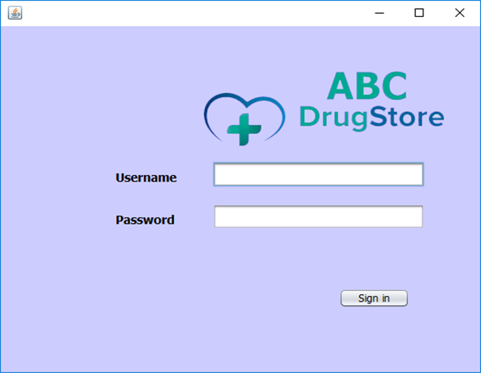
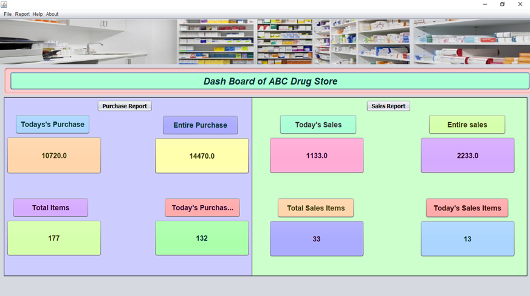
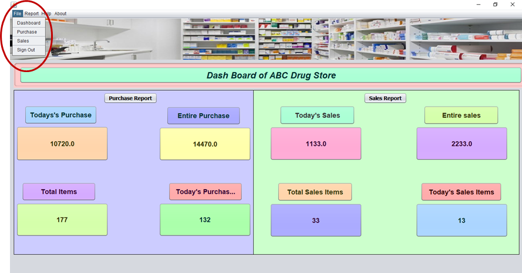
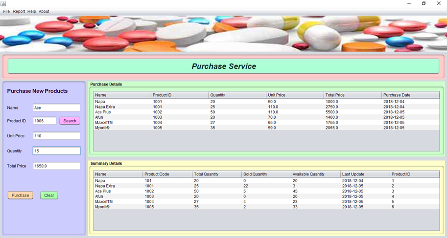
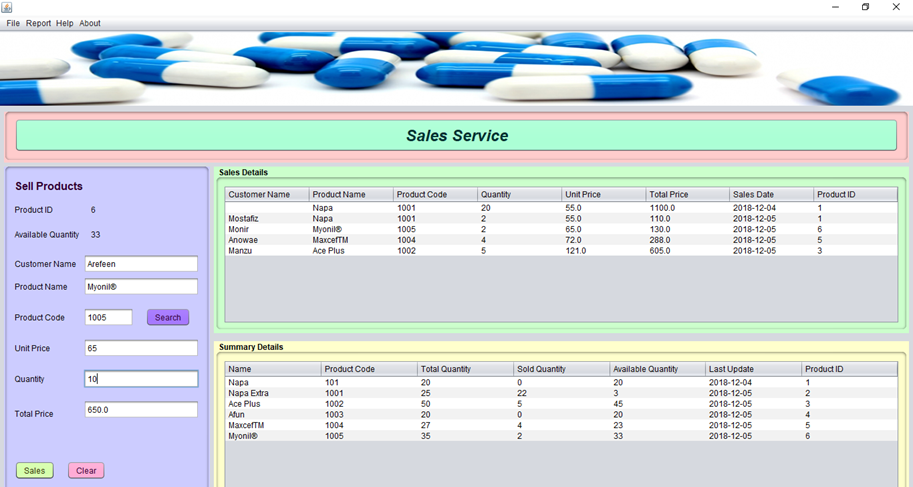
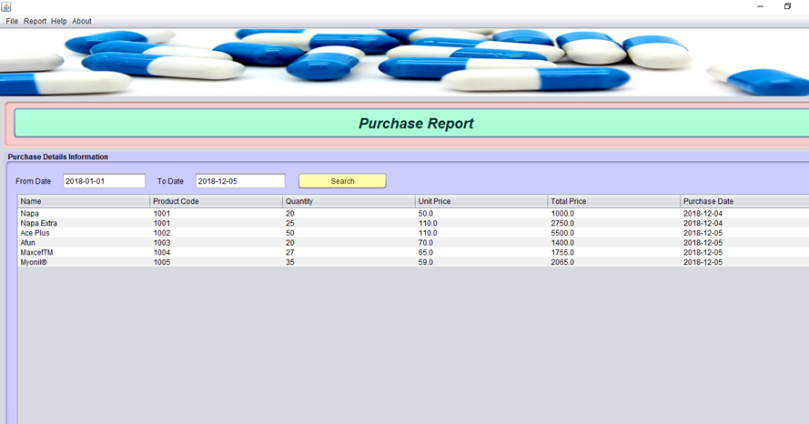
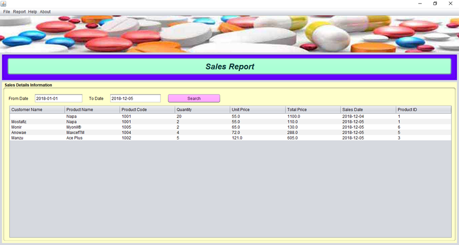
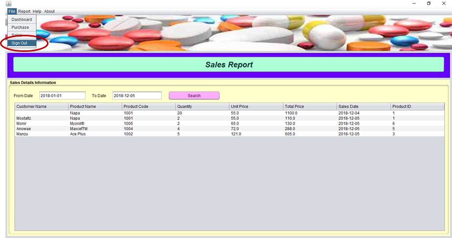

# Drug Store Management System (dsms) 
This application build in using Core Java, Java Swing, Hibernate, MySQL & NetBeans IDE etc.

#Login Form

#Dashboard

#File Menue

#Purchase Service

#Sales Service

#Purchase Report

#Sales Report

#Logout

